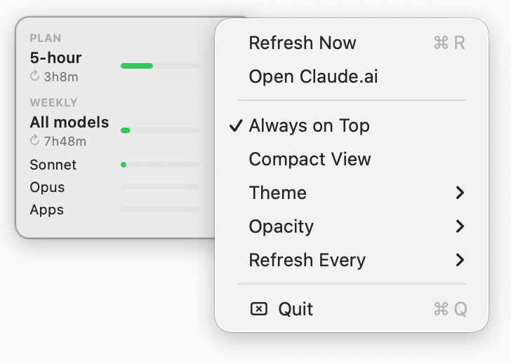
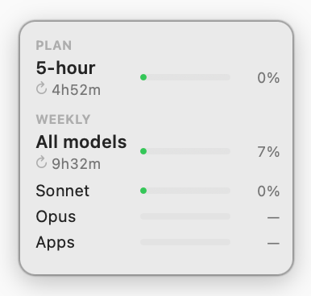
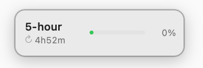
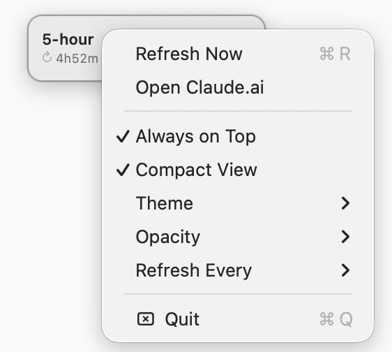

# claude-desktop-usage

**English** · [简体中文](README.zh-CN.md)

> A tiny macOS floating widget that shows your Claude.ai usage at a glance — without opening the browser.


<p align="center">
  
</p>

## The problem

When you use Claude (Pro / Max), you always want to know how much quota you have left:
- Can I keep going in this 5-hour window?
- How far has the 7-day weekly quota been burned?
- How long until it resets?

Open the browser → log in → Settings → scroll to the Usage section — checking that several times a day gets old fast.

This tool keeps that info parked in a small floating widget in the top-right corner of your desktop, so you can glance at it without switching windows.

## What it looks like

Live screenshots:

<table>
  <tr>
    <td align="center" valign="top"><br><sub><b>Full mode</b> (default)</sub></td>
    <td align="center" valign="top"><br><sub><b>Compact mode</b></sub></td>
    <td align="center" valign="top"><br><sub><b>Right-click menu</b></sub></td>
  </tr>
</table>

Equivalent ASCII sketch, two modes (toggled from the right-click menu):

```
┌──────────────────────┐       ┌──────────────────────┐
│ PLAN                 │       │ 5-hour    ███░░  44% │
│ 5-hour    ███░░  44% │       │           ↻ 1h36m    │
│           ↻ 1h36m    │       └──────────────────────┘
│ WEEKLY               │
│ All models █░░░  24% │           ↑ Compact mode
│           ↻ 4h6m     │
│ Sonnet    ░░░░░   0% │
│ Opus      ░░░░░   —  │
│ Apps      ░░░░░   —  │
└──────────────────────┘

   ↑ Full mode (default)
```

- Always on top (can be turned off)
- Drag it anywhere, position is remembered
- 5h utilization turns yellow at ≥75%, red at ≥90%
- Right-click menu: Refresh / Open Claude.ai / Always on Top / Compact View / Theme (System/Dark/Light) / Opacity (50/65/80/100%) / Refresh Every (1/5/15/30 min)
- No Dock icon, quietly resident

## How it works

Data comes through your already-logged-in **Claude desktop app** local session — no second login, no API key.

```
macOS Keychain            Claude.app cookies (SQLite)
       │                            │
       │  PBKDF2-SHA1               │  AES-128-CBC
       │  (saltysalt, 1003)         │  (IV = 16 spaces)
       ▼                            ▼
  AES-128 key  ────────►  sessionKey / cf_clearance / __cf_bm / ...
                                     │
                                     │ Cookie header + Claude.app's exact UA
                                     │ (Claude/x.y Chrome/z.w Electron/v Safari/...)
                                     ▼
                  GET claude.ai/api/organizations/<org>/usage
                                     │
                                     ▼
                  { five_hour: {...}, seven_day: {...}, ... }
```

Three layers:

- `claude_usage.py`: the data path (a library, stdlib only) — reads the Keychain, decrypts the cookie, builds the Claude.app UA, makes the request via `curl`
- `poc_fetch_usage.py`: a CLI verification script that prints the full JSON
- `float_widget.swift` + `build_app.sh` → `Claude Usage.app`: the native macOS floating window

## Install

Prerequisite: you've logged into the **Claude desktop app** before (so the cookie exists).

### Option A — one-line install (recommended)

```bash
curl -L -o /tmp/claude-usage.zip \
  https://github.com/eastonsuo/claude-desktop-usage/releases/latest/download/Claude-Usage.app.zip \
  && unzip -oq /tmp/claude-usage.zip -d /Applications/ \
  && xattr -dr com.apple.quarantine "/Applications/Claude Usage.app" \
  && rm /tmp/claude-usage.zip \
  && open "/Applications/Claude Usage.app"
```

What it does: pull the latest release → unzip into `/Applications/` → strip quarantine (bypass Gatekeeper, since the app is unsigned) → launch.

Manual (if you'd rather not run a script): grab `Claude-Usage.app.zip` from [Releases](https://github.com/eastonsuo/claude-desktop-usage/releases/latest), unzip and drag it to `/Applications`, then **right-click → Open → click Open again in the dialog** (only once) to get past Gatekeeper.

### Option B — build from source

```bash
git clone https://github.com/eastonsuo/claude-desktop-usage.git
cd claude-desktop-usage
./build_app.sh                          # output: dist/Claude Usage.app

open "dist/Claude Usage.app"             # first run
cp -R "dist/Claude Usage.app" /Applications/   # install to Applications
```

### Keychain authorization on first run

The first time it fetches usage, macOS shows one system prompt: `python wants to access 'Claude Safe Storage'` — click **Always Allow**. The same Python interpreter won't ask again.

### Launch at login

After installing to `/Applications`, go to **System Settings → General → Login Items & Extensions → Open at Login → "+"** and choose `Claude Usage.app`.

## Caveats

- **macOS only**: cookie decryption goes through the macOS Keychain; nobody has written it for other platforms
- **Non-public endpoint**: it's an internal endpoint claude.ai's own frontend uses, and Anthropic may change it at any time. If it breaks, capture the `/api/.../usage` request in the web app and compare
- **Claude.app upgrades re-sign cf_clearance**: `claude_usage.py` reads Claude.app's plist + Electron framework binary live each time to build a UA that tracks the version automatically — but if the app changes its UA structure, it needs re-debugging
- **Refresh sparingly**: 5h / 7d data changes slowly, 1–5 min is plenty; too frequent and you'll get rate-limited

## Debug

```bash
# see the full JSON
python3 poc_fetch_usage.py

# see the captured UA / cookie names / HTTP status
CLAUDE_USAGE_DEBUG=1 python3 poc_fetch_usage.py 2>&1 >/dev/null | grep claude_usage

# manually override the UA (extreme cases)
CLAUDE_USAGE_UA='...' python3 poc_fetch_usage.py

# dev mode: run the raw binary (not packaged as .app)
swiftc -O -o claude-usage-float float_widget.swift
./claude-usage-float                   # finds poc_fetch_usage.py from cwd

# reset widget position / theme / opacity / refresh interval
defaults delete io.github.claude-desktop-usage
```

## Disclaimer

**Not affiliated with Anthropic.** This tool is a personal utility that piggybacks on Claude.ai's internal (non-public, undocumented) usage endpoint via your locally-stored Claude desktop app session. Anthropic does not endorse it, and the endpoint may change or break at any time.

**For personal use only.** Please don't redistribute pre-built binaries, run it on a schedule that hammers the endpoint, or otherwise create load that would draw rate-limiting or unwanted attention. The whole point is to glance at your own usage occasionally.

## License

[MIT](./LICENSE)
